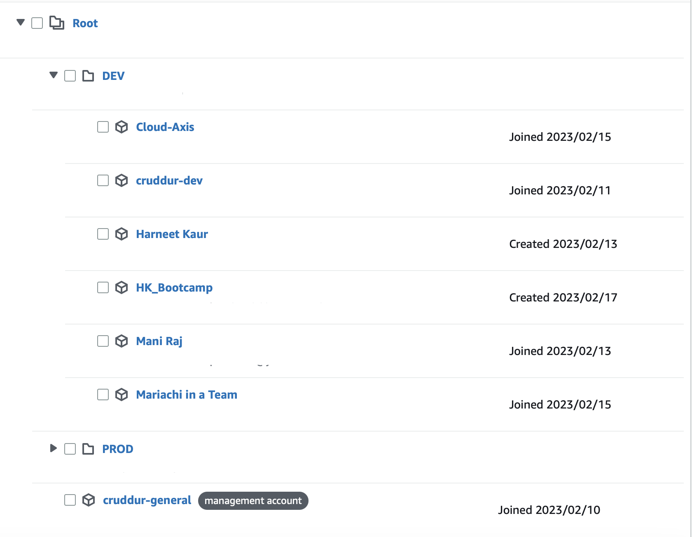

# Week 0 — Billing and Architecture

## $${\color{white}Team:\color{blue}Cloud \space West}$$ 
## $${\color{white}Team \space Members:\color{blue}Mani \space Raj \space \space \space allan-hsu \space \space \space mariachiinajar \space \space \space HemaKar \space \space \space HK}$$ 
## $${\space \color{blue}Harneet \space Kaur \space \space \space Ultra \space Man \space \space \space Arunmano \space \space \space Maayaa-06 \space \space \space UltraBoostDevil}$$ 

 ## Team To Do Checklist:
   
| TASK | COMPLETED |
|  --- |    ---    |
| Watched Live - Streamed Video | :heavy_check_mark: |
| Watched Chirag's - Spend Considerations   | -- |
| Watched Ashish's - Security Considerations | -- |
| Recreate Conceptual Diagram in Lucid Charts or on a Napkin | -- |
| Recreate Logical Architectual Diagram in Lucid Charts | -- |
| Create an Admin User | -- |
| Use CloudShell | -- |
| Generate AWS Credentials | -- |
| Installed AWS CLI | -- |
| Create a Billing Alarm | :heavy_check_mark: |
| Create a Budget | :heavy_check_mark: |

## Current AWS Organizations Structure

1. `cruddur-dev` account contains IAM role `iamdeveloper` with just enough permissions for development.
2. Only ccounts under **DEV OU** are permitted to assume `iamdeveloper` role for access to AWS resources, otherwise permissions are very limited.

## Architecture Diagrams

HemaKar (HK):

k3kmani (Mani Raj):

allan-hsu (Allan Hsu): [Conceptual and Logical Diagrams](https://lucid.app/lucidchart/f7e59b81-605f-4131-af03-1657c3f03f6e/edit?invitationId=inv_fcbe1868-1e2e-4e80-a987-ff61c0c6f463)

mariachiinajar:

ultraman-labs (Tony Quintanilla): [Conceptual Diagrams](https://lucid.app/lucidchart/d2677e12-bcf6-476a-aed2-3d9d7ef324b8/edit?viewport_loc=-321%2C64%2C2560%2C1244%2C0_0&invitationId=inv_bb3d008f-13c4-4567-a2d5-ea2dfe5556bb) and [Logical Diagrams pending]

maayaa06:
